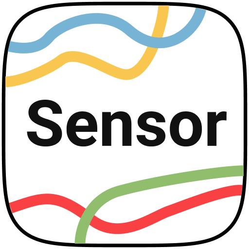

<p align="center">
  
</p>

<h1 align="center">SensorBox</h1>

<p align="center">
  Raw phone and watch sensors, recorded to files you own.
</p>

<p align="center">
  
  
  
</p>

## See it in use

<table>
  <tr>
    <td width="25%"></td>
    <td width="25%"></td>
    <td width="25%"></td>
    <td width="25%"></td>
  </tr>
  <tr>
    <td align="center"><sub>Choose exactly what to capture.</sub></td>
    <td align="center"><sub>Set timing and recording rules.</sub></td>
    <td align="center"><sub>Record from the watch on its own.</sub></td>
    <td align="center"><sub>See a live signal before committing.</sub></td>
  </tr>
</table>

## The idea

SensorBox turns Android and Wear OS hardware into a field recorder. Pick the sensors, start a visible recording, and get plain CSV files in a folder you chose. No account, analytics SDK, or cloud storage sits in the middle.

## What it does

- Records available phone and watch sensors at Android sampling periods
- Adds foreground GPS samples when requested
- Runs through an explicit foreground service with safe stop paths
- Shows a live watch signal with a Compose chart
- Sends watch recordings to the phone through the Wear OS Channel API
- Writes phone measurements through Android's Storage Access Framework
- Keeps active recordings alive if the paired device disconnects

## How it is built

Phone and watch screens use MVI:

```text
Composable -> Intent -> ViewModel -> use case -> repository -> State + Effect
```

| Module | Purpose |
| --- | --- |
| `app` | Phone UI, permissions, paired recording, and received watch files |
| `wear` | Watch UI, live charts, and standalone recording |
| `recording-core` | Pure Kotlin recording state machine and cleanup rules |
| `sensorservices` | Android sensor, GPS, foreground-service, and file adapters |
| `WearOsLib` | Versioned commands and Channel file transport |
| `core` / `core-common` | Preferences, storage, diagnostics, results, and errors |

Hilt wires the Android implementations behind testable interfaces. Each device owns its recording clock and local files.

## Build it

You need JDK 17 and Android SDK 37. A Wear OS device or emulator is only needed to run the watch app and paired tests.

```shell
./gradlew :app:assembleDebug :wear:assembleDebug
./gradlew testDebugUnitTest detekt
./gradlew :app:lintDebug :wear:lintDebug
```

No Firebase project, Maps key, secrets file, or external-storage permission is required.

SensorBox is licensed under the [Apache License 2.0](LICENSE).
