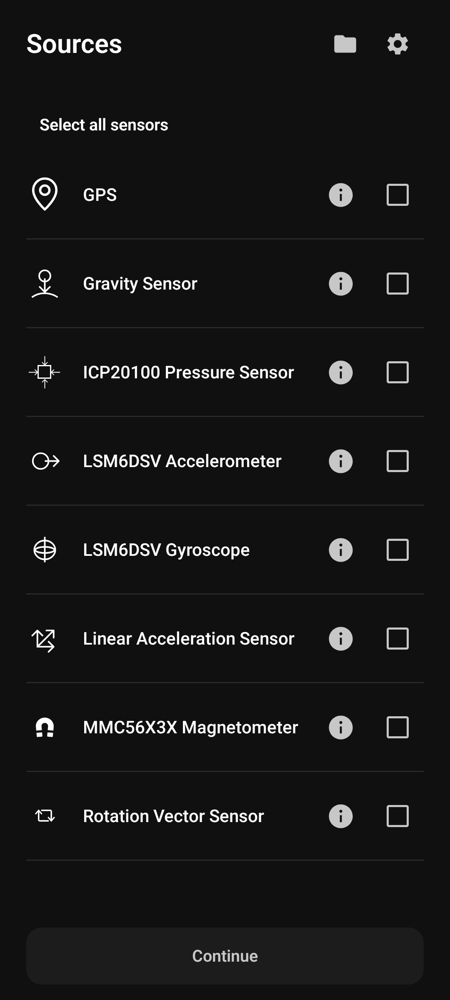
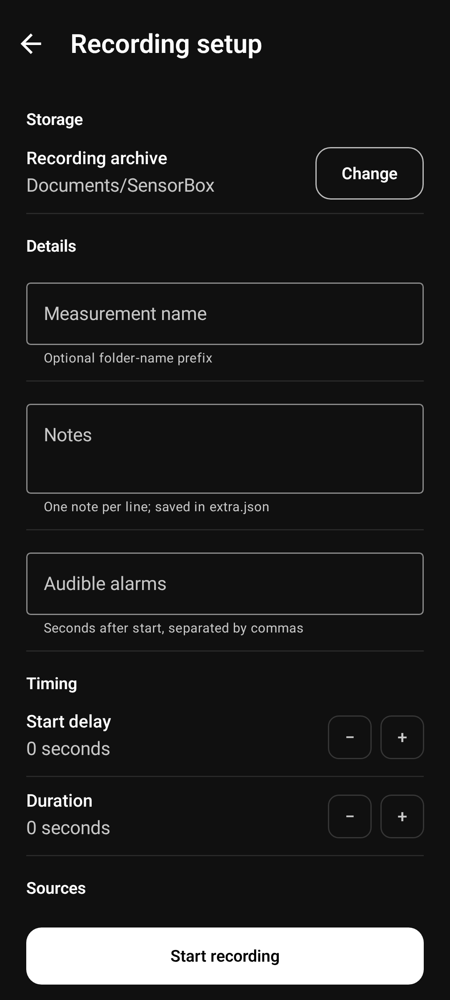
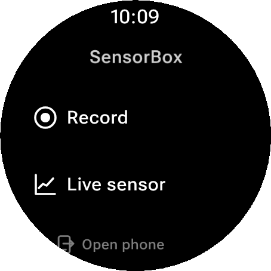
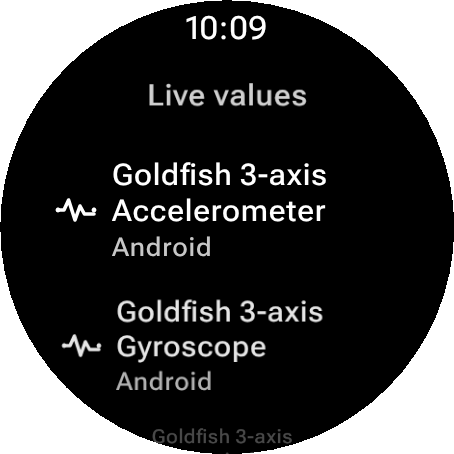
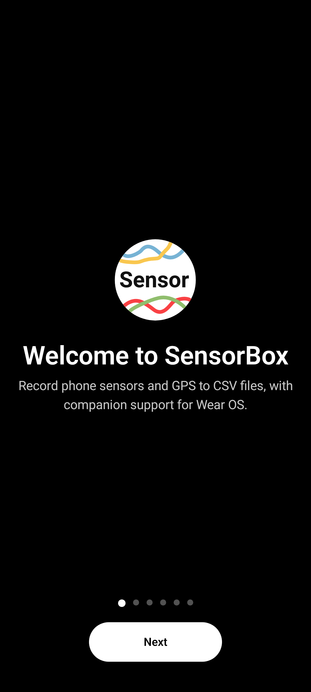
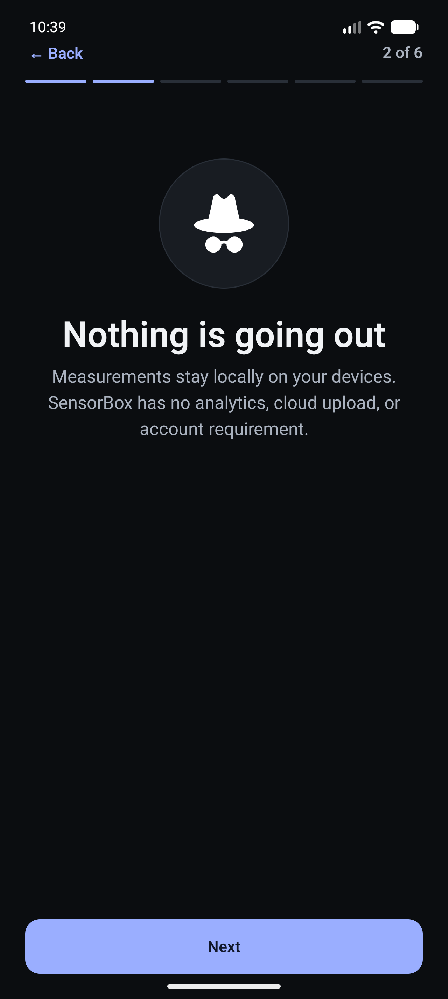
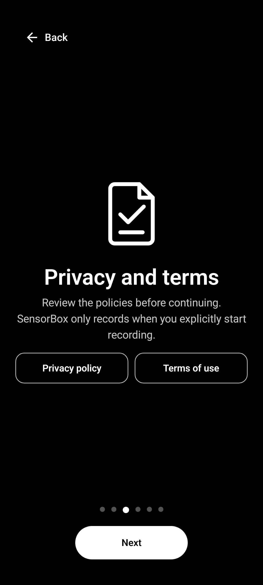
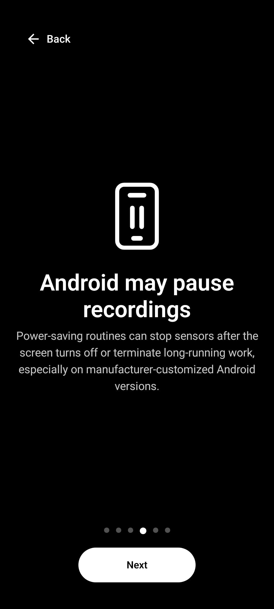
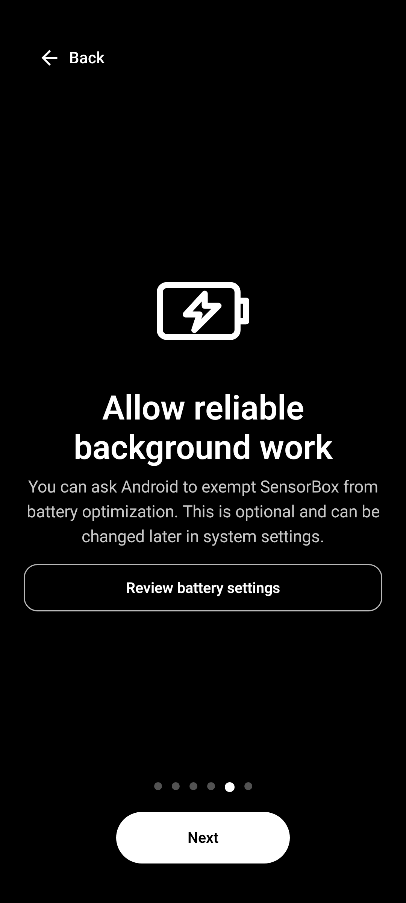
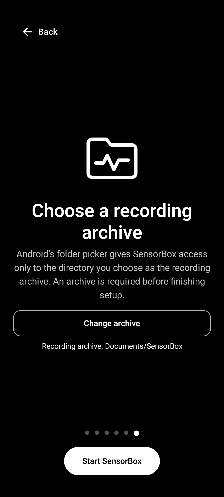

# SensorBox

SensorBox records raw Android and Wear OS sensor samples to local CSV files. The phone app uses Android's system folder picker; recordings never require cloud storage or an account.

This is the hard-cut Android 17 generation of the project. It does not retain the former Fragment/XML UI, `SharedPreferences`, Firebase, Maps, or compatibility migrations for old settings.

## Screenshots

| Sensor selection | Measurement setup |
|:---:|:---:|
|  |  |

| Wear dashboard | Wear live-sensor picker |
|:---:|:---:|
|  |  |

### First-run introduction

| Welcome | Local data | Privacy and terms |
|:---:|:---:|:---:|
|  |  |  |

| Android lifecycle | Battery optimization | Recording folder |
|:---:|:---:|:---:|
|  |  |  |

The introduction uses tintable vector illustrations that follow the app theme. Privacy Policy, Terms of Use, battery optimization, and folder selection are live native actions. Folder selection remains mandatory before setup can finish.

All screenshots above come from deterministic Compose preview fixtures. Refresh the complete gallery on the host without an emulator or connected device:

```shell
./gradlew refreshReadmeScreenshots
```

## Current feature set

- Record available phone or watch sensors at Android sampling periods.
- Record foreground GPS samples alongside sensor data.
- Run measurement work in an explicit foreground service with health/location service types.
- Stop safely from the app, watch, notification, low-battery policy, or a paired-device command.
- Preview a live watch sensor with a Compose-native chart.
- Stream watch recordings to the phone with the Wear OS Channel API.
- Store phone recordings in a user-selected Storage Access Framework folder.
- Follow system/dynamic color with light, dark, and custom fallback palettes.

## Architecture

The UI modules use unidirectional MVI:

`Composable → Intent → ViewModel → use case → repository/service → State + Effect`

UI launchers execute one-shot effects, while decisions and state transitions remain in workflow-owned ViewModels, reducers, and focused use cases. The phone shell owns navigation only. Hilt provides production dependencies and interfaces keep platform boundaries replaceable in tests.

Modules:

- `app`: phone Compose UI, workflow-owned MVI, paired-recording policy, permissions, and received watch files.
- `wear`: Wear Compose Material 3 UI, MVI, live charts, recording, and phone launch flow.
- `core-common`: platform-neutral `AppResult`, stable application errors, and diagnostics contracts.
- `recording-core`: pure Kotlin recording state machine, source roles, scheduling, and cleanup policy.
- `core`: Android DataStore preferences, document storage, local rotating diagnostics, and reusable test fixtures.
- `sensorservices`: Android recording adapters, foreground host, and linear sensor/GPS writers. It has no Wear dependency.
- `WearOsLib`: coroutine-based connectivity, strict protocol v5 JSON commands, and Channel file transport. App policy stays in `app` and `wear`.

Paired phone/watch recording starts directly on each device. Commands are session-correlated and idempotent, and both devices own their local duration timer after starting. A lost connection does not stop an active recording; peer stop notifications are best effort.

## Platform and toolchain

- Android Gradle Plugin 9.3.2 and Gradle 9.7
- Android compile/target SDK 37 (Android 17)
- Java 17 and Kotlin 2.4.10
- Jetpack Compose Material 3 and Wear Compose Material 3
- Hilt 2.60.1
- DataStore Preferences 1.2.1
- Detekt 2 with formatting rules and no baselines

Every Kotlin function is checked at a maximum of 40 lines. Compose functions therefore also stay below the requested 60-line ceiling.

## Build and quality checks

Install JDK 17 and Android SDK 37, then run:

```shell
./gradlew :app:assembleDebug :wear:assembleDebug
./gradlew testDebugUnitTest detekt
./gradlew :app:lintDebug :wear:lintDebug
./gradlew :app:validateDebugScreenshotTest :wear:validateDebugScreenshotTest
```

Instrumentation test sources can be compiled without a device:

```shell
./gradlew :app:compileDebugAndroidTestKotlin :wear:compileDebugAndroidTestKotlin
```

Tests use Given/When/Then naming, reusable state/repository fixtures, coroutine test contexts, and Compose robots for end-to-end UI interactions.

## Emulator integration tests

The phone recording tests start the real foreground measurement service, read the device sensors, control test GPS and battery state from Kotlin, and verify the generated files. Run the class directly from Android Studio or with Gradle:

```shell
ANDROID_SERIAL=emulator-5554 ./gradlew :app:connectedDebugAndroidTest \
  "-Pandroid.testInstrumentationRunnerArguments.class=com.tomasrepcik.sensorbox.emulator.PhoneSensorRecordingEmulatorTest"
```

Standalone Wear recording tests use the watch sensors and control test GPS and battery state from Kotlin. They do not require a paired phone:

```shell
ANDROID_SERIAL=emulator-5554 ./gradlew :wear:connectedDebugAndroidTest \
  "-Pandroid.testInstrumentationRunnerArguments.class=com.tomasrepcik.sensorbox.emulator.WearSensorRecordingEmulatorTest"
```

The paired sync matrix sends CSV, JSON, text, empty, Unicode, overwrite, duplicate-name, ignored-extension, and 256 KiB fixtures through the real Wear OS Channel API. The phone verifies every destination and byte. Use a Google Play phone AVD and a Wear OS AVD, then pair them once with Android Studio's Pairing Assistant:

```shell
ANDROID_HOME="$HOME/Library/Android/sdk" tools/emulator/run_wear_sync_test.sh
```

The runner detects one phone and one watch automatically; `PHONE_SERIAL` and `WEAR_SERIAL` remain available when several devices are connected. It builds and installs once, refreshes the ADB bridge after installation, and launches each scenario on both devices. When an emulator transport exposes its paired node but does not propagate static capabilities, the instrumentation-only repository falls back to that connected node; file transfer still uses the production Channel client and receiver. Received files use app-internal storage only in debuggable builds; release builds continue to require the user-selected Storage Access Framework directory.

No Firebase project, Maps key, secrets file, or external storage permission is required.

## Dependencies

The former Flipper, AppIntro, Material Dialogs, NumberPicker, Android About Page, LicensesDialog, Toasty, GraphView, and custom countdown modules have been removed. Their replacements are native APIs or small project-owned Compose components.

[Vico](https://github.com/patrykandpatrick/vico) is retained as the sole feature-level third-party UI library because it provides a maintained, Compose-native chart model and renderer suitable for the live Wear OS plot. AndroidX, Google Play services for Wear/location, Kotlin coroutines, Hilt, and Detekt remain infrastructure dependencies.

## Privacy

Measurements are initiated by the user, represented by an ongoing foreground-service notification, and written locally. SensorBox does not upload measurement data or include analytics/crash-reporting SDKs.

## License

SensorBox is licensed under the Apache License 2.0. See [LICENSE](LICENSE).
